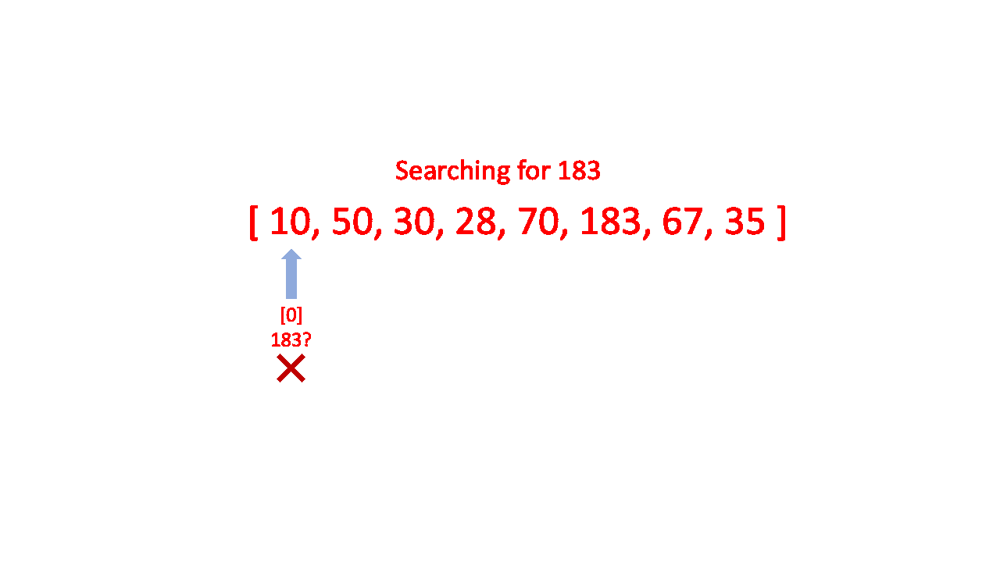

# Data Structure

**Linear Search:**

 

[In linear search Algorithm](https://www.educative.io/blog/object-oriented-programming)

- Every element is considered as a potential match for the key and checked for the same.
- If any element is found equal to the key, the search is successful and the index of that element is returned.
- If no element is found equal to the key, the search yields “No match found”.
<pre>
Ps code:
- Function accepts an array and a value.
- Looping through the array and check if 
current array element in each index is equal to the value.
- If matched, return the array index at which the element value is found.
- If no matched, return -1
</pre>

