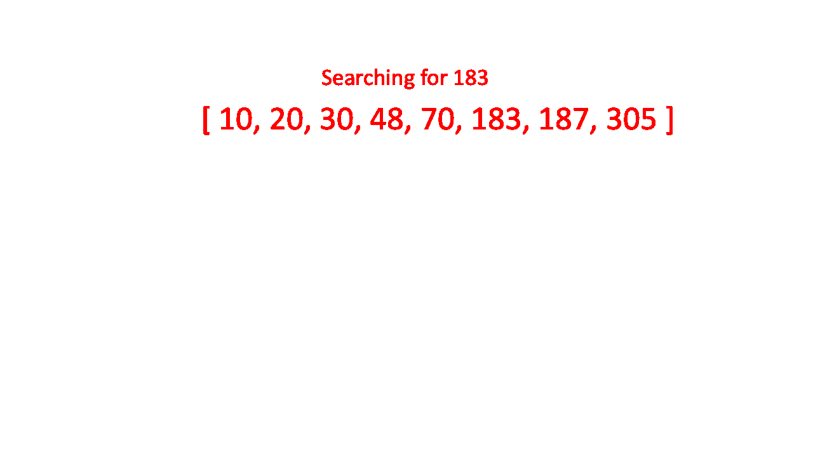

# Data Structure

**Linear Search:**

 

[Binary Algorithm](https://www.programiz.com/dsa/binary-search)

Binary Search is a searching algorithm for finding an element's position in a sorted array.
In this approach, the element is always searched in the middle of a portion of an array.

<pre>
Ps code:
- Function accepts an array and a value.
- Looping through the array and check if 
current array element in each index is equal to the value.
- If matched, return the array index at which the element value is found.
- If no matched, return -1
</pre>

<pre>
BIG O:
- O(1), Best Scenario. Where we found the element on the first search.
- O(n), Worst Scenario. Where we loop n times to the last 
element and find the element.
- O(n), Average Scenario. Where we loop through a few n times to find the element.

</pre>

 

